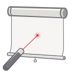
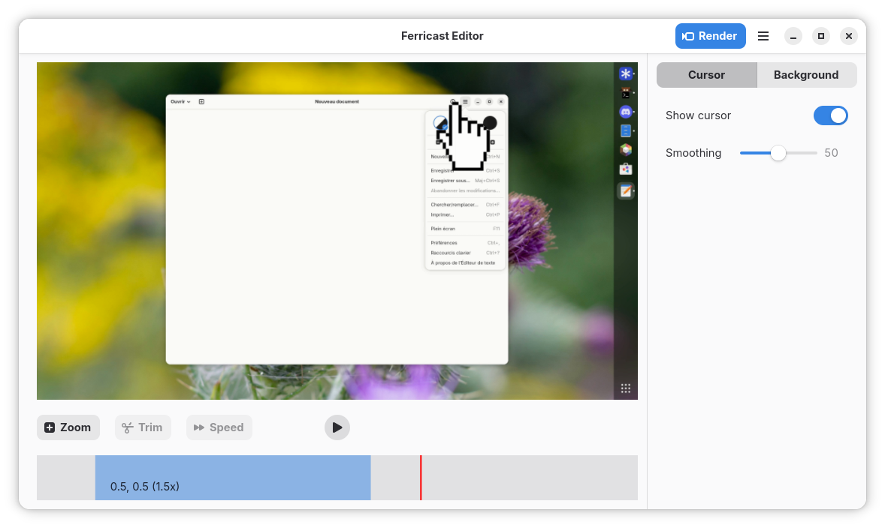

# Ferricast

Ferricast lets you record your screen and turn the result into a polished demo video.
A Linux-native alternative to Screen Studio, built with GTK and Rust.

- Record your screen or a specific window
- Add smooth zoom effects that animate automatically
- Overlay your mouse cursor and animate its movement
- Preview your edits in real time
- Trim the beginning and end of your recording
- Export to video or GIF

## Screenshots

